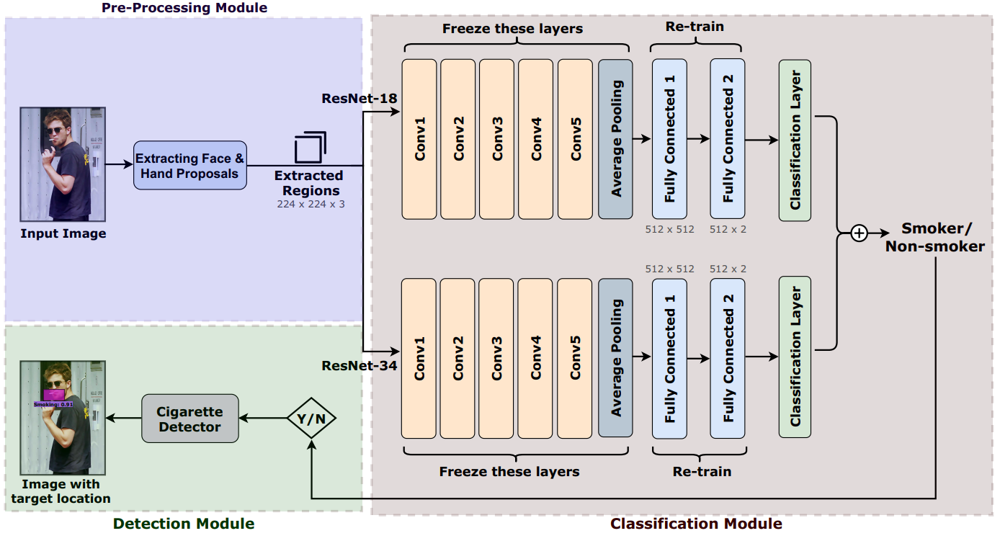
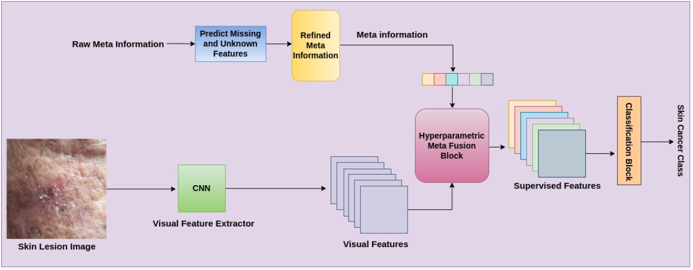
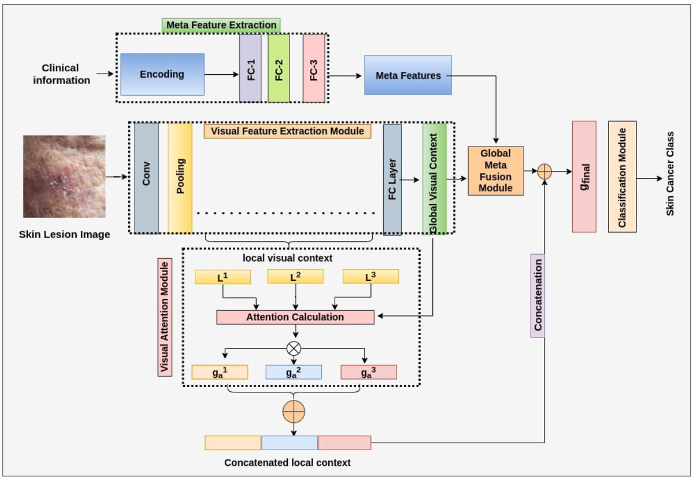
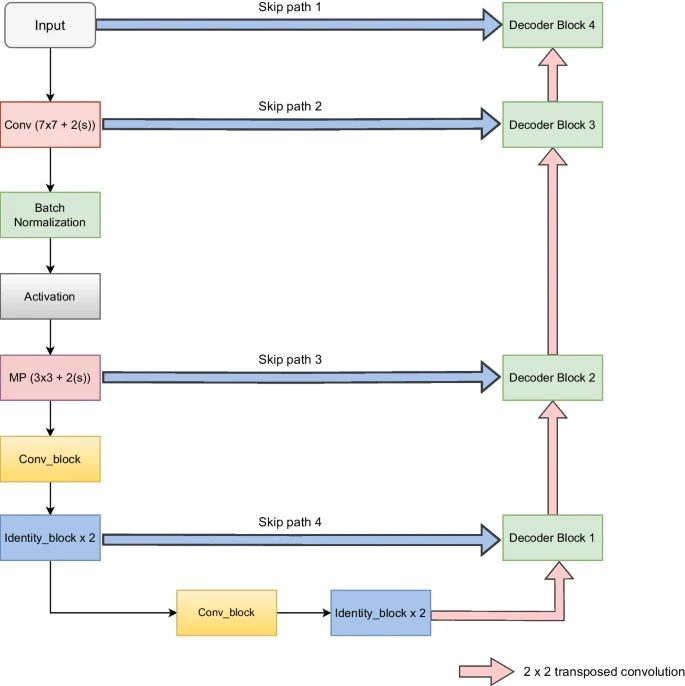

  
  <a href="#contact" class="ui-btn ui-shadow ui-corner-all ui-btn-inline ui-mini" style="float:right"><pre>Contact</pre></a>
  
  <a href="#research_interests" class="ui-btn ui-shadow ui-corner-all ui-btn-inline ui-mini" style="float:right"><pre>Research_Interests</pre></a>
  
  <a href="#achievements" class="ui-btn ui-shadow ui-corner-all ui-btn-inline ui-mini" style="float:right"><pre>Achievements</pre></a>
  
  <a href="#education" class="ui-btn ui-shadow ui-corner-all ui-btn-inline ui-mini" style="float:right"><pre>Education</pre></a>
  
  <a href="#experience" class="ui-btn ui-shadow ui-corner-all ui-btn-inline ui-mini" style="float:right"><pre>Experience</pre></a>
  
  <a href="#publications" class="ui-btn ui-shadow ui-corner-all ui-btn-inline ui-mini" style="float:right"><pre>Publications</pre></a>
  
  <a href="#about" class="ui-btn ui-shadow ui-corner-all ui-btn-inline ui-mini" style="float:right"><pre>About</pre></a>
  
  <a href="https://github.com/AnshulPundhir/AnshulPundhir.github.io/blob/gh-pages/cv.pdf" target="cv.pdf" style="float:right"><pre>CV</pre></a>

   
 

 

## About

I am a Ph.D. student in the Computer Science and Engineering department at Indian Institute of technology, Roorkee. I have joined the Ph.D. in Dec, 2019 under supervision of Prof. [Balasubramanian Raman](https://balarsgroup.github.io/). Before joining Ph.D., I have completed my bachelor's and master's degree from [Dayalbagh Educational Institute, Agra](https://www.dei.ac.in/dei/).  

## Education

**Ph.D.* (Computer Science)**\
_Indian Institute of Technology, Roorkee_\
**Joining Date:** Dec, 2019\
**Course Work Details: (CGPA: 9.26)** \
    - Evolutionary Algorithms  \
    - Medical Imaging          \
    - Research Methodology     \
    - Soft Computing           \
**Research Area:** Medical Image Analysis \
**Supervisor:** [Prof. Balasubramanian Raman](https://balarsgroup.github.io/)

**Int. M.Tech. (Computer Science), 2019**\
_Dayalbagh Educational Institute, Agra_ \
**Supervisor:** [Dr. R.S. Pavithr](https://www.dei.ac.in/dei/science/index.php/phy-faculty/90-physicsfaculty/159-mr-r-s-pavithr) \
**CGPA**: 8.51

**Int. M.Sc. (Computer Science), 2018**\
_Dayalbagh Educational Institute, Agra_\
**Supervisor:** [Dr. R.S. Pavithr](https://www.dei.ac.in/dei/science/index.php/phy-faculty/90-physicsfaculty/159-mr-r-s-pavithr) \
**CGPA**: 8.30

**B.Sc. (Computer Science), 2017**\
_Dayalbagh Educational Institute, Agra_\
**CGPA**: 8.45

## Achievements
   - Gave a topper talk on chamomile tea with toppers for JRF strategy [(Link)](https://youtu.be/Uv5tegbd3Vs) 
   - NTA NET JRF (99.88% ile), 2019
   - GATE qualified, 2018
   - NET (June, Dec) qualified, 2018
   - Awarded third in National Science Exhibition, 2013
   - Third rank in city, National Science Olympiad, 2011
 
## Research_Interests
   - Medical Imaging
   - Computer Vision 
   - Machine learning  
   - Deep Learning

## Experience
   - Selected for Six-months Deloitte work-studentship program
   - Intern at Samsung R&D Institute Bangalore (SRI-B), India (August 2022 - February 2023)
   - Intern at IISc Bangalore (April-July, 2021) 
   - Attended *The Workshop on Computer Vision and Image Processing (WCVIP)*, IIT Roorkee, Uttarakhand, 14-24 Dec 2020 (Virtual) 
   - Attended *IEEE International Conference on Image Processing (ICIP)*, Abu Dhabi, UAE, 25-28 Oct 2020 (Virtual)
   - Organized a training session on *Dimensionality Reduction Algorithms* during the workshop on Digital Image Processing & Applications (DIPA) at NIT Arunachal Pradesh, Aug 2020 (Virtual)
   
## Publications

  

    
  

  

    
Anshul Pundhir, Deepak Verma, Puneet Kumar, Balasubramanian Raman, "Region Extraction Based Approach for Cigarette Usage Classification Using Deep Learning", In: Raman, B., Murala, S., Chowdhury, A., Dhall, A., Goyal, P. (eds) Computer Vision and Image Processing. CVIP 2021. Communications in Computer and Information Science, vol 1568. Springer. https://doi.org/10.1007/978-3-031-11349-9_33.

  

  

    
  

  

    
Anshul Pundhir, Saurabh Dadhich, Ananya Agarwal, Balasubramanian Raman, "Towards Improved Skin Lesion Classification using Metadata Supervision", 26th International Conference on Pattern Recognition (ICPR), Montreal, QC, Canada, 2022, pp. 4313-4320, doi: 10.1109/ICPR56361.2022.9956071

  

  

    
  

  

    
Anshul Pundhir, Ananya Agrawal, Saurabh Dadhich, Balasubramanian Raman, "Visually Aware Metadata-Guided Supervision for Improved Skin Lesion Classification Using Deep Learning", In: , et al. Ethical and Philosophical Issues in Medical Imaging, Multimodal Learning and Fusion Across Scales for Clinical Decision Support, and Topological Data Analysis for Biomedical Imaging. EPIMI ML-CDS TDA4BiomedicalImaging 2022. Lecture Notes in Computer Science, vol 13755. Springer. https://doi.org/10.1007/978-3-031-23223-7_6.

  

  

    
  

  

    
Kishore Babu Nampalle, Anshul Pundhir, Pushpamanjari Ramesh Jupudi, Balasubramanian Raman, "Towards improved U-Net for efficient skin lesion segmentation". Multimed Tools and Applications (MTAP), 2024, https://doi.org/10.1007/s11042-024-18334-5

  

##   Contact
Anshul Pundhir \
Department of Computer Science and Engineering\
N-319, Machine Intelligence Lab\
Indian Institute of Technology, Roorkee\
e-mail: anshul_p [at] cs [dot] iitr [dot] ac [dot] in

   
